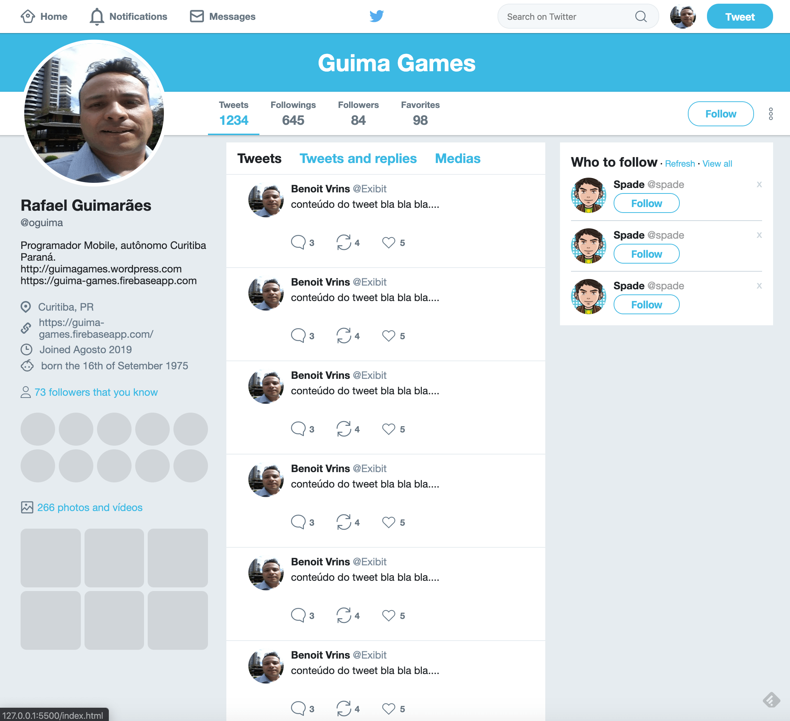

30/01/2020
<h1 align="center">Twitter Clone - Estudos Flexbox</h1>

Estudos para criar um design clone do twitter, para estudos do flexbox.

    

## TODO;
- responsividade

## VSCode: 
Interessante o uso do VSCode, com a extenção Live Server:

Para ativar:
cmd + shift + p

Live server: Open with live server.
